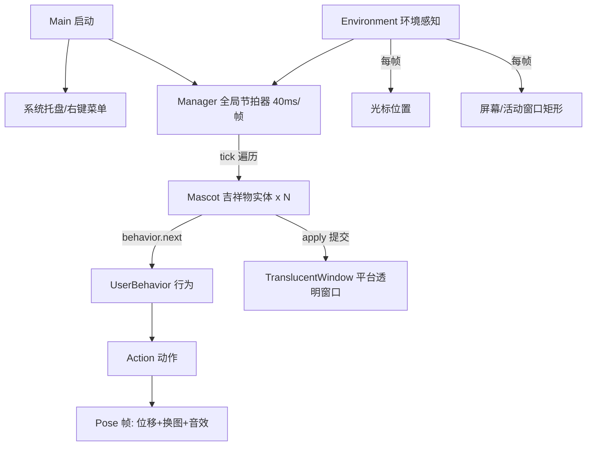
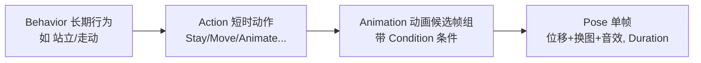
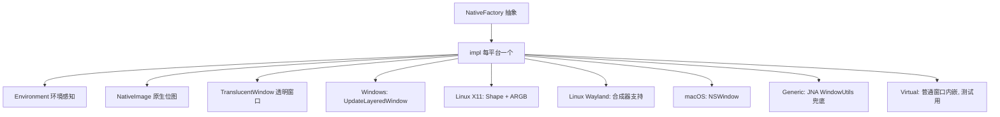

# 架构总览

本文描述 Shimeji-Phrolova 的运行时架构：包结构、核心协作、行为系统、渲染管线与平台抽象。源码包根为 `com.group_finity.mascot`。

## 包结构

```
com.group_finity.mascot
├── Main.java             # 入口：配置加载、初始化、托盘
├── Manager.java          # 全局节拍器（唯一“世界推进者”）
├── Mascot.java           # 单个吉祥物实体
├── behavior/             # 行为：Behavior 接口 / UserBehavior / BehaviorReference
├── action/               # 动作原语：ActionBase 及各类 Action
├── image/                # 图像管线：ImagePair(Loader/s)、MascotImage、NativeImage
├── script/               # 表达式引擎：Variable / VariableMap（Rhino）
├── win/ x11/ mac/ wayland/ generic/ virtual/
│                         # 各平台原生实现（环境/原生图像/透明窗口）
├── localization/         # 多语言文本资源
├── settings/             # 配置读写与设置窗体
└── util/                 # 工具（含 hqx 像素放大）
```

## 运行时核心协作

整个程序围绕**一个节拍线程 + 一组对象**运转：



### Manager：节拍模型

- 全局唯一，以 **40ms（25 FPS）** 的 `TICK_INTERVAL` 推进，采用**累计节拍对齐**避免固定 sleep 的漂移
- 单帧停顿超过 2 个节拍（80ms）时直接对齐当前时间，防止“追帧风暴”
- 每轮 `tick()` 分四阶段：
  1. 刷新环境（`Environment.tick()`）
  2. 合并 `added`/`removed` 暂存集合到活动列表
  3. 遍历每个 `mascot.tick()` 推进逻辑（仅当处于动画态且行为非空）
  4. 遍历每个 `mascot.apply()` 应用状态（定位、换图、可见性）
- 全部吉祥物消失后调用 `exit()` 结束程序

### 两阶段并发集合

任何线程想增删吉祥物（托盘菜单、鼠标事件）都只修改 `added`/`removed` **暂存集合**，真正生效统一在下一轮节拍内完成，从而天然规避 `ConcurrentModificationException`。

### Mascot：吉祥物实体

每个吉祥物在构造时即创建自己的 `TranslucentWindow` 透明窗口：

- 持有 `anchor`（脚部锚点）、当前 `image`、`lookRight`（朝向）、`behavior`、全局累计 `time` 等状态
- 注册鼠标监听：`press/release` 驱动行为切换，`move/drag` 驱动热点悬停与光标
- 右键弹出菜单；构造即 `setAlwaysOnTop(true)`
- **定位公式**：窗口左上角 = 锚点 − 图像中心（`left = anchor.x − center.x`），图像中心在加载时已按缩放系数换算
- `dispose()` 时依次关闭调试窗、置非动画、销毁窗口、通知 Manager 移除

### Environment：环境感知

- 抽象 `Environment` 描述外部世界：屏幕（`Area`）、活动窗口、光标位置
- 每个吉祥物持有一个 `MascotEnvironment`，其边界模型 `Area` 除矩形外还区分四边性质：
  - `Wall`（左右墙，可攀爬）、`FloorCeiling`（地板/天花板，可站立与倒挂）
- 后台守护线程每 5 秒刷新屏幕矩形缓存，支持多显示器热插拔

## 行为系统：四层模型

行为规则完全由 **XML 配置** 描述（`conf/actions.xml`、`conf/behaviors.xml`），Java 侧只提供动作原语：



- **Behavior**（`behavior/Behavior`）：接口含 `init/mousePressed/mouseReleased`；唯一实现 `UserBehavior` 由配置构建
- **Action**（`action/ActionBase` 及子类）：`init` 绑定变量与动画；`hasNext` 判断继续；`next` 推进一帧——若抛出 `LostGroundException`（失去地面），由行为层捕获切换至 `Fall`
- **Animation**：一组带条件的候选帧，`getPoseAt(time)` 以 `time %= duration` 循环取帧；条件不满足的动画被过滤
- **Pose**：单帧效果 = 锚点位移（`dx/dy`，向右时 `dx` 反向）+ 换图（含朝向翻转）+ 音效

### 行为推进主流程

每帧 `UserBehavior.next()`：

1. 当前动作 `hasNext()` → 继续推进
2. 否则调用 **加权随机决策器** 选择下一个行为：
   - 收集 `isEffective`（条件求值）且启用的候选，按 `Frequency` 累计权重
   - 前一个行为若声明了 `<NextBehaviorList>` 则追加其候选
   - 随机数命中即选中；候选为空时兜底回落到 `Fall`
3. 按住热点期间：检测新出现的热点并即时切换行为
4. 越出屏幕：随机横向落位到屏幕顶上方，再切换 `Fall` 掉入
5. `CantBeAliveException`（如角色被移除）→ 销毁该吉祥物

鼠标交互规则：点击命中热点 → 触发对应行为；否则若 `Draggable=false` 则不拖拽；再否则切换 `Dragged`；松开正在拖拽的角色 → 切换 `Thrown`（带抛出惯性）。

::: tip 硬编码约束
`Fall`、`Dragged`、`Thrown` 三个行为名被代码硬编码引用（`UserBehavior.BEHAVIOURNAME_*`），**任何图像集的 `behaviors.xml` 都必须声明它们**。
:::

### 表达式系统

XML 属性中的表达式支持两种求值时机（Rhino 引擎，`script/`）：

| 语法 | 求值时机 | 适用场景 |
|---|---|---|
| `${expr}` | **每帧**求值（`initFrame`） | 光标位置、贴地判断等动态值 |
| `#{expr}` | **每次行为开始**求值（`init`） | 随机站姿等一次性决策 |

可用上下文：`mascot`（anchor/imageSet/lookRight/count/totalCount/getBounds…）、`mascot.environment`（screen/workArea/activeIE/cursor/floor/ceiling/leftWall/rightWall…）、`action`，以及 `<Constant>` 常量。

## 渲染管线

从一张 PNG 到屏幕上可动的透明角色：


要点：

- **预乘 alpha**：RGB 各通道乘以 alpha，避免缩放/绘制时的黑边与亮边伪影，也是像素算法正确性的前提
- **HQX 滤镜**：查表式像素放大（2/3/4/6/8 倍），对源像素 3×3 邻域生成相似性掩码并查表混色，放大效果平滑；其余倍率自动退回最近邻
- **窗口绘制**（Windows 实现）：创建内存 DC 选入 HBITMAP，`UpdateLayeredWindow` + `BLENDFUNCTION(AC_SRC_ALPHA)` 一次合成，SourceConstantAlpha 即全局透明度
- 触发链：`Mascot.apply()` → `setBounds` + `setImage` + `updateImage()` → 平台重绘

## 平台抽象

上层逻辑（Manager/Mascot/Action）与操作系统完全解耦，通过 `NativeFactory` 抽象工厂产出三件套：



- **平台选择**：启动时按 `settings.properties` 的 `Environment` 键（默认 `generic` 自动探测）与系统类型路由；Wayland 通过 `WAYLAND_DISPLAY` / `XDG_SESSION_TYPE` 识别
- **虚拟桌面模式**（`Environment=virtual`）：吉祥物显示在普通 `JFrame` 内，用于无原生透明窗口的开发调试与演示
- 全项目零 JNI，原生能力全部经 **JNA** 调用系统库（`user32`、X11 Xlib、macOS 等）
- Wayland 会话限制最多（无系统托盘时自动降级为右键菜单），Windows 与 X11 能力最完整

## 线程模型

| 线程 | 职责 |
|---|---|
| Manager 节拍线程 | 唯一的“世界推进者”，`tick`/`apply` 全串行 |
| EDT（事件分发线程） | 托盘、右键菜单、拖拽事件；经暂存集合异步注入世界 |
| 后台守护线程 | 环境屏幕缓存（5s）刷新、音效播放 |
