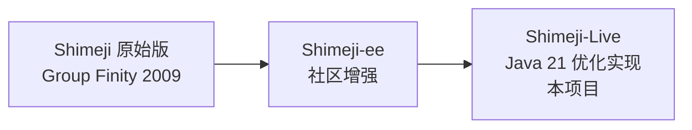
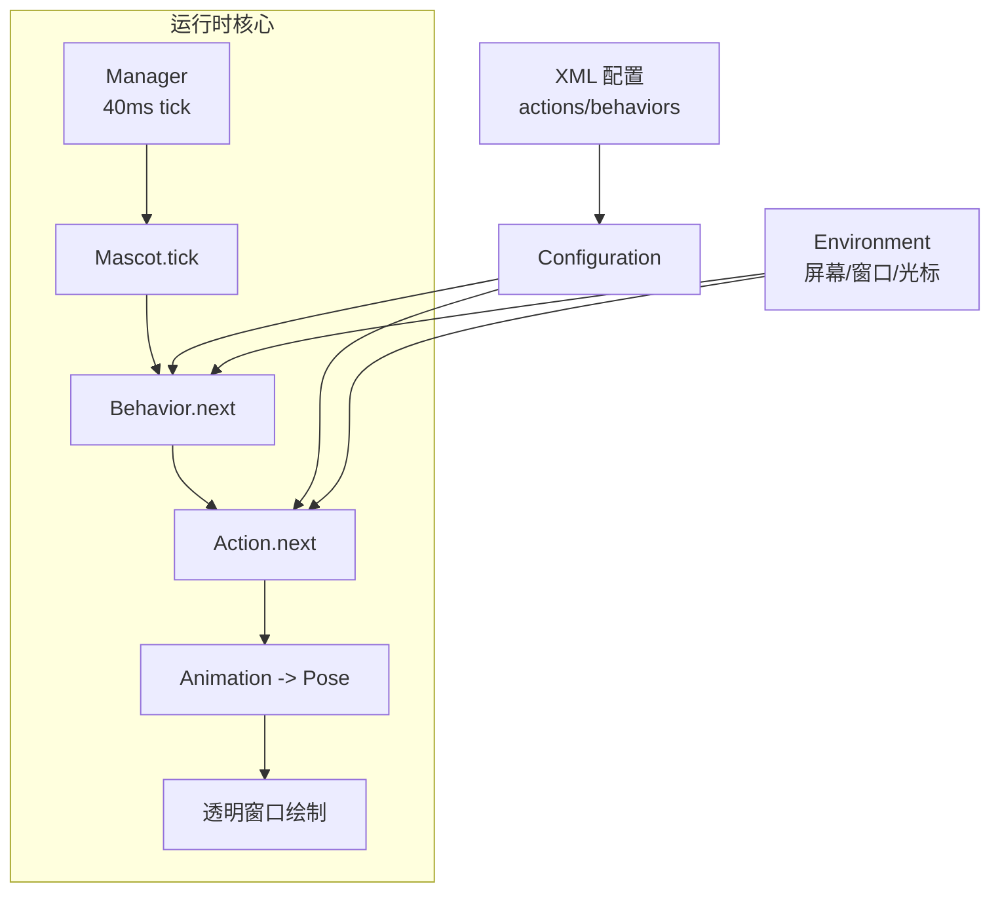

# 00 · 项目总览与索引

> 本文档是 `fll-shimije` 项目学习文档的入口。目标读者：计划在此基础上学习并进行优化扩展的开发者。
> 建议阅读顺序：`00` → `01` → `02` → `03` → `04` → `05`，`06` 为 LicenseManager 残余代码清理备忘，可随时查阅。

---

## 1. 项目是什么

这是一个 **Shimeji（桌宠）桌面程序的 Java 21 优化实现**，包根为 `com.group_finity.mascot`，直接继承自经典 Shimeji / Shimeji-ee 的开源血统：

| 阶段 | 作者/组织 | 说明 |
|---|---|---|
| 原始 Shimeji | Group Finity（Yuki Yamada） | 2009 年原创，Zlib 协议 |
| Shimeji-ee | Shimeji-ee Group | 社区增强版，BSD-2-Clause |
| 本仓库 | Begonia（fll-shimije） | Java 21 重编译优化 + 二次开发，Maven 管理 |



**核心功能**：在桌面上生成一个个会四处游荡、攀爬、玩耍的小人（桌宠），支持多图像集（不同外观/行为），可拖拽、抛出、交互，有系统托盘菜单与设置界面。

---

## 2. 技术栈

依据 `pom.xml`：

| 项 | 值 |
|---|---|
| 语言 | Java 21（`maven.compiler.release=21`） |
| 构建 | Maven（默认 `clean compile`，`run` profile 可打包并运行） |
| 原生访问 | JNA 5.17.0 + jna-platform（跨平台调用 Win32 / X11 / macOS API） |
| 脚本引擎 | Mozilla Rhino 1.7.14（行为配置中的 `${...}` / `#{...}` 表达式） |
| UI 外观 | FlatLaf 3.6 + FlatLaf IntelliJ Themes（设置窗口主题） |
| 布局 | NetBeans AbsoluteLayout（Swing 手写表单） |
| 打包 | maven-shade（fat jar）+ jpackage（Win/macOS/Linux 安装包） |

启动参数示例（pom `run` profile）：`-Xmx512M -Xms128M -XX:+UseG1GC ...`，并强制开启 `--add-opens` / `--enable-native-access` 以兼容 JDK 21 模块化。

---

## 3. 目录结构全景

```
fll-shimije/
├── pom.xml                        # Maven 构建 + jpackage 多平台打包
├── README.md                      # 项目说明（当前是学习阶段说明）
├── LICENSE
├── conf/                          # 运行期配置（用户可改）
│   ├── settings.properties        # 主设置（语言/缩放/过滤器/行为开关）
│   ├── actions.xml                # 动作定义（默认图像集，可被图像集内覆盖）
│   ├── behaviors.xml              # 行为定义与状态转移概率
│   ├── language*.properties       # 多语言（en-GB / zh-CN）
│   ├── schema*.properties         # XML 标签名映射（en-US / ja-JP）
│   ├── logging.properties         # java.util.logging 配置
│   ├── Mascot.xsd                 # XML Schema
│   └── theme.properties           # 自定义主题色（可选）
├── img/                           # 图像集（每个子目录 = 一个桌宠外观）
├── sound/                         # 音效目录
├── macos-resources/               # macOS jpackage 资源
├── docs-site/                     # 静态文档站点（另用，非核心代码）
├── xiaorui/                       # 学习笔记目录（本文档所在）
│   ├── fll.png
│   └── docs/                      # ← 本项目学习文档
└── src/main/java/
    ├── hqx/                       # hq2x/3x/4x 像素放大算法（独立包）
    └── com/group_finity/mascot/   # 主程序
        ├── Main.java              # 入口 + 单例控制器
        ├── Manager.java           # 桌宠管理 + tick 主循环
        ├── Mascot.java            # 桌宠对象
        ├── NativeFactory.java     # 平台抽象工厂
        ├── DPIManager.java        # 高 DPI 自动配置
        ├── SettingsWindow.java    # 设置窗口（含 LicenseManager 残余）
        ├── InformationWindow.java # 图像集信息窗口
        ├── DebugWindow.java       # 调试统计窗口
        ├── LogFormatter.java      # 日志格式器
        ├── Platform.java          # 平台枚举（x86 / x86_64）
        ├── action/                # 短时动作
        ├── animation/             # 动画（帧序列）
        ├── behavior/              # 长期行为状态机
        ├── config/                # XML 配置解析 + 构建器
        ├── environment/           # 桌面环境抽象
        ├── exception/             # 自定义异常
        ├── generic/               # 通用跨平台 fallback 实现
        ├── hotspot/               # 热点（可点击区域）
        ├── image/                 # 图像加载/缩放/窗口接口
        ├── imagesetchooser/       # 图像集选择对话框
        ├── mac/                   # macOS 实现
        ├── menu/                  # 长菜单分页
        ├── script/                # Rhino 表达式变量系统
        ├── sound/                 # 音效
        ├── virtual/               # 虚拟桌面（测试模式）
        ├── wayland/               # Linux Wayland 实现
        ├── win/ + win/jna/        # Windows 实现 + Win32 JNA 绑定
        └── x11/                   # Linux X11 实现
```

---

## 4. 核心机制一览（速览）

| # | 机制 | 一句话原理 | 详见文档 |
|---|---|---|---|
| 1 | 启动流程 | `Main.main` 设置 JVM 属性 → 加载 settings → 加载 XML 配置 → 建托盘 → 建桌宠 → 启动 Manager | `01` |
| 2 | 主循环 | `Manager` 以 40ms 间隔 tick，驱动所有 `Mascot` 的 `tick()` 与 `apply()` | `02` |
| 3 | 行为状态机 | `Behavior`（长期）→ `Action`（短时）→ `Animation`（帧序列）→ `Pose`（单帧位移+换图） | `03` |
| 4 | 配置驱动 | `actions.xml`/`behaviors.xml` 经 `Entry` → `Configuration` 构建出可执行对象 | `03` |
| 5 | 表达式 | `${expr}`（每帧求值）/ `#{expr}`（每行为求值），基于 Rhino | `03` |
| 6 | 图像管线 | `ImagePairLoader`：加载 → 预乘透明 → 缩放（nearest/hqx/bicubic）→ 翻转 | `04` |
| 7 | 透明窗口 | 平台原生分层窗口（Win: `UpdateLayeredWindow`；X11: shape + alpha） | `04`/`05` |
| 8 | 平台抽象 | `NativeFactory` 按 OS / 环境变量选 win/x11/mac/wayland/generic | `05` |
| 9 | 环境感知 | `Environment` 每 tick 同步屏幕/工作区/活动窗口/光标位置 | `02` |



---

## 5. 文档索引

| 文档 | 主题 |
|---|---|
| [00-项目总览与索引.md](00-项目总览与索引.md) | 你在这里 |
| [01-启动流程与主入口.md](01-启动流程与主入口.md) | `Main` 生命周期、配置加载、DPI/主题/托盘/图像集选择 |
| [02-核心类与架构.md](02-核心类与架构.md) | `Manager`/`Mascot`/`NativeFactory`/`Environment` 等核心类 |
| [03-行为状态机与配置系统.md](03-行为状态机与配置系统.md) | 行为/动作/动画三层模型、XML 解析、变量系统 |
| [04-渲染与图像系统.md](04-渲染与图像系统.md) | 图像加载缩放管线、透明窗口、HQX 算法 |
| [05-平台抽象与原生实现.md](05-平台抽象与原生实现.md) | 平台工厂与各平台（Win/X11/macOS/Wayland/Generic）实现 |
> **提示**：阅读时可对照源码。所有行号以当前工作区快照为准，后续修改可能漂移。
