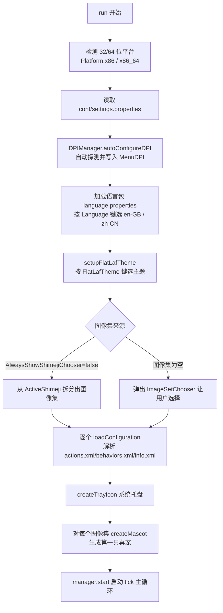
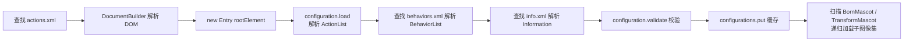

# 01 · 启动流程与主入口

> 对应源码：`src/main/java/com/group_finity/mascot/Main.java`
> `Main` 既是入口，也是全局单例控制器（`Main.getInstance()`），持有一切全局状态：配置、图像集、语言包、属性、Manager、托盘图标。

---

## 1. 入口与静态初始化

`main` 方法（L346）只做两件事：配置高 DPI，然后调用 `getInstance().run()`。

```java
public static void main(final String[] args) {
    configureHighDPIGlobally();   // 渲染/DPI 相关系统属性
    try {
        getInstance().run();
    } catch (OutOfMemoryError err) {
        Main.showError("Out of Memory. ...");
        System.exit(0);
    }
}
```

### 1.1 静态代码块（class 加载时执行，L94）

- 打印 OS / Java 版本信息；
- **Windows D3D 硬件加速**：`sun.java2d.d3d=true`；
- **DPI 兼容模式**：`sun.java2d.dpiaware=false`、`uiScale=1.0` 等，强制还原 Java 8 行为（保证桌宠按像素精确绘制）；
- 读取 `logging.properties` 初始化日志。

### 1.2 `configureHighDPIGlobally()`（L299）

针对 macOS 开启 Metal、`apple.laf.useScreenMenuBar` 等；通用部分启用 **Marlin 渲染引擎**（`sun.java2d.renderer=...MarlinRenderingEngine`）与字体抗锯齿。

---

## 2. run() 主流程



### 关键步骤分解

| 步骤 | 方法 | 说明 |
|---|---|---|
| 1. 平台检测 | `run()` L372 | 依据 `sun.arch.data.model`，设置 `Platform.x86(20)` / `x86_64(24)`（bitmap 宽度，X11 用） |
| 2. 属性加载 | `run()` L389 | `conf/settings.properties` → `Properties`；文件缺失静默使用默认值 |
| 3. DPI 自动配置 | `DPIManager.autoConfigureDPI(properties)` | 按屏幕 DPI 自动写回 `MenuDPI`（见下） |
| 4. 语言加载 | `run()` L404 | `ResourceBundle.getBundle("language", locale, new Utf8ResourceBundleControl(false))`，支持 UTF-8 中文 |
| 5. 主题加载 | `setupFlatLafTheme()` L164 | 按 `FlatLafTheme` 值选 dark/intellij/cyan/solarized/light；再读 `conf/theme.properties` 自定义强调色 |
| 6. 图像集确定 | `run()` L428 | 若配置 `AlwaysShowShimejiChooser=false` 且 `ActiveShimeji` 非空，则按 `/` 拆分；否则弹选择框 |
| 7. 配置加载 | `loadConfiguration(imageSet)` L485 | 见 §3 |
| 8. 托盘 | `createTrayIcon()` L738 | 见 §5 |
| 9. 首只桌宠 | `createMascot(imageSet)` L1196 | 见 §6 |
| 10. 启动主循环 | `getManager().start()` | `Manager` 线程开始 40ms tick |

---

## 3. loadConfiguration —— 图像集配置加载

`loadConfiguration` 是理解"一个图像集 = 一个桌宠外观+行为包"的关键。其查找顺序（`actions.xml` 为例）：

1. `conf/actions.xml`（全局默认）
2. `conf/<imageSet>/actions.xml`（图像集专属）
3. `img/<imageSet>/conf/actions.xml`（图像集内嵌）

同时兼容多种历史文件名（`動作.xml`、`行動.xml`、`two.xml`、`2.xml`、乱码名等，兼容旧 Shimeji-ee 分发）。



> **BornMascot / TransformMascot**：`actions.xml` 中动作若带这两个属性，说明该动作会"生出子桌宠"或"变身"，这些子图像集会被递归加载进 `configurations` 与 `childImageSets`，用于运行时动态创建。

---

## 4. 全局单例与常用入口

```java
public static Main getInstance();      // 单例
public Configuration getConfiguration(String imageSet);  // 取某图像集的配置
public void createMascot();            // 随机图像集创建桌宠
public void createMascot(String imageSet);
public Properties getProperties();
public ResourceBundle getLanguageBundle();
public Platform getPlatform();
public void exit();                    // disposeAll + stop + System.exit(0)
```

---

## 5. createTrayIcon —— 系统托盘

- 从外部 `./img/icon.png` 或 classpath 加载图标（`loadIconImage`）；
- 注册鼠标监听：**右键/弹出触发** → 弹出自定义 `JDialog` 菜单（呼唤、跟随鼠标、只留一只、恢复窗口、行为开关、换图像集、设置、语言、自启动、暂停、全部关闭）；
- **左键单击** → 创建新桌宠；**中键双击** → 切换"全部存在/全部消失"模式；
- 托盘不可用（Wayland 常见）时降级为仅桌宠右键菜单，并打印提示。

---

## 6. createMascot —— 创建桌宠

```java
public void createMascot(String imageSet) {
    final Mascot mascot = new Mascot(imageSet);
    mascot.setAnchor(new Point(-4000, -4000));   // 屏幕外生成
    mascot.setLookRight(Math.random() < 0.5);    // 随机朝向
    try {
        mascot.setBehavior(getConfiguration(imageSet).buildNextBehavior(null, mascot));
        this.getManager().add(mascot);
    } catch (BehaviorInstantiationException | CantBeAliveException e) {
        log.log(Level.SEVERE, "...", e);
        Main.showError(...);
        mascot.dispose();
    }
}
```

要点：
- 出生点在屏幕外（`-4000,-4000`），随后 `buildNextBehavior` 会随机落位并切换到 `Fall` 行为，让桌宠"掉入"屏幕；
- 行为构建失败会弹错误框并销毁该桌宠，避免脏状态。

---

## 7. 运行时重载与热切换

- **设置窗口关闭后**（`Main.java` L953）：若 `EnvironmentReloadRequired` 或 `ImageReloadRequired`，会 `disposeAll` → `ImagePairs.clear()` → 重新 `loadConfiguration` → 重新建桌宠（图片缩放/滤镜变更生效）；
- **切换语言**（`updateLanguage` / `refreshLanguage`）：重建语言包并同样重载全部桌宠；
- **切换图像集**（`setActiveImageSets`）：基于 `childImageSets` 递归处理新增/移除，涉及 `addImageSet` / `removeLoadedImageSet`。

---

## 8. settings.properties 关键配置项

| 键 | 默认 | 作用 |
|---|---|---|
| `ActiveShimeji` | - | 启用的图像集，`/` 分隔 |
| `AlwaysShowShimejiChooser` | false | 每次启动都弹图像集选择框 |
| `AlwaysShowInformationScreen` | false | 总是显示信息页 |
| `Environment` | generic | 强制指定运行环境：`generic`/`virtual`/`wayland`（详见文档 05） |
| `Filter` | nearest | 缩放滤镜：`nearest`/`bicubic`/`hqx` |
| `Scaling` | 1.0 | 桌宠缩放倍率 |
| `Opacity` | 1.0 | 透明度 |
| `Language` | en-GB | 语言 |
| `MenuDPI` | 96 | 菜单缩放参考 DPI（DPIManager 自动写回） |
| `Breeding` | true | 允许繁殖 |
| `Transients` / `Transformation` / `Throwing` | true | 行为开关 |
| `Multiscreen` | true | 多显示器支持 |
| `Sounds` | true | 音效开关 |
| `DisabledBehaviours.<imageSet>` | - | 按图像集禁用行为（`/` 分隔） |
| `FlatLafTheme` | light | UI 主题名 |
| `InteractiveWindows` / `InteractiveWindowsBlacklist` | - | 交互窗口列表（桌宠可攀爬/投掷的窗口） |

---

## 9. 学习要点

1. `Main` 是**单例控制器 + 全局配置中心**，几乎所有功能都通过 `Main.getInstance()` 访问共享状态；
2. 启动流程本质是"**加载配置 → 实例化对象 → 启动循环**"，配置（XML）与代码（Behavior/Action）完全解耦；
3. 图像集是插件式扩展点：放一个新目录到 `img/`（含 `conf/` + PNG 帧），即可获得一只新桌宠；
4. DPI 处理是本项目相对原版的重点优化方向之一，涉及 `DPIManager`、`Main` 静态块、`Main.configureHighDPIGlobally` 三处配合。
