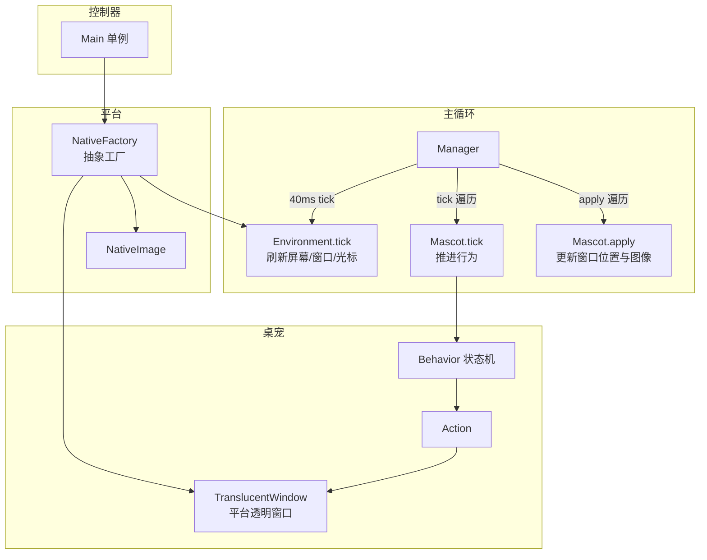
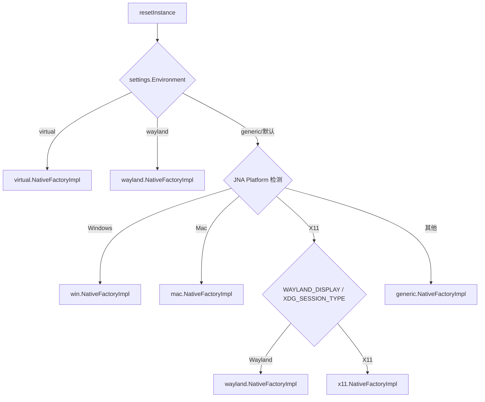
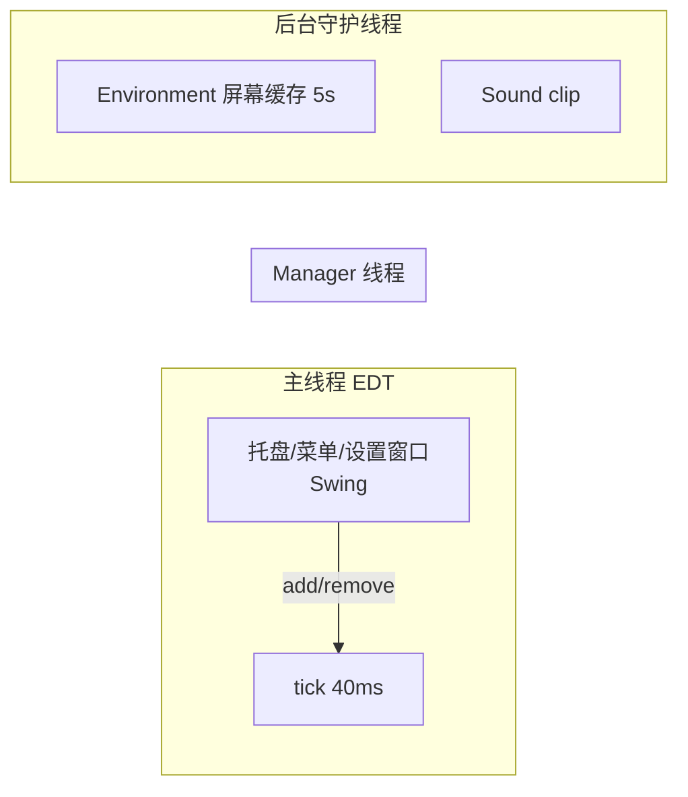

# 02 · 核心类与架构

> 本文梳理运行时"骨架"：`Manager`（主循环）、`Mascot`（桌宠实体）、`NativeFactory`（平台抽象）、`Environment`（环境感知），以及它们的协作关系。

---

## 1. 总体协作图



- **Manager**：只有一只，负责全局节拍；
- **Mascot**：每只桌宠一个，持有自己的窗口、行为、位置、图像；
- **NativeFactory**：全局平台工厂，产出窗口/图像/环境的具体实现；
- **Environment**：描述"外部世界"（屏幕、活动窗口、光标），由 NativeFactory 按平台提供。

---

## 2. Manager —— 全局节拍器

源码：`src/main/java/com/group_finity/mascot/Manager.java`

### 2.1 节拍模型

```java
public static final int TICK_INTERVAL = 40;   // 毫秒，即 25 FPS
```

`start()` 启动一个非 daemon 线程，循环：

```java
long prev = System.nanoTime() / 1000000;
for (;;) {
    for (;;) {
        final long cur = System.nanoTime() / 1000000;
        if (cur - prev >= TICK_INTERVAL) {
            if (cur > prev + TICK_INTERVAL * 2) {
                prev = cur;            // 掉帧超过 2 tick：丢弃积压
            } else {
                prev += TICK_INTERVAL; // 正常推进（对齐节拍）
            }
            break;
        }
        Thread.sleep(1, 0);
    }
    tick();
}
```

要点：
- 采用"**累计节拍对齐**"而非固定 sleep，避免漂移；若某帧卡顿超过 80ms 则直接丢弃，防止"追帧风暴"；
- 线程非 daemon，保证应用存活。

### 2.2 tick() 的四个阶段

```java
private void tick() {
    // ① 刷新环境信息（屏幕区域、光标、活动窗口）
    NativeFactory.getInstance().getEnvironment().tick();

    synchronized (this.getMascots()) {
        // ② 合并"待添加/待移除"集合，避免遍历中 ConcurrentModificationException
        for (final Mascot mascot : this.getAdded()) this.getMascots().add(mascot);
        this.getAdded().clear();
        for (final Mascot mascot : this.getRemoved()) this.getMascots().remove(mascot);
        this.getRemoved().clear();

        // ③ 推进每只桌宠的逻辑（行为/动作）
        for (final Mascot mascot : this.getMascots()) mascot.tick();
        // ④ 应用状态到窗口（移动、换图、绘制）
        for (final Mascot mascot : this.getMascots()) mascot.apply();
    }

    if (isExitOnLastRemoved() && this.getMascots().isEmpty()) {
        Main.getInstance().exit();   // 全部桌宠消失则退出
    }
}
```

> 设计亮点：`added`/`removed` 两个 `LinkedHashSet` 是"两阶段提交"——任何线程调用 `add()`/`remove()` 只改暂存集合，真正生效统一在下一轮 tick 内完成，天然线程安全。

### 2.3 常用管理操作

| 方法 | 作用 |
|---|---|
| `add(Mascot)` / `remove(Mascot)` | 暂存增删 |
| `setBehaviorAll(name)` | 让所有桌宠切换到指定行为（托盘"跟随光标"） |
| `remainOne()` / `remainOne(mascot)` / `remainOne(imageSet)` | 只留一只 |
| `remainNone(imageSet)` | 移除某图像集所有桌宠 |
| `togglePauseAll()` / `isPaused()` | 全局暂停/恢复 |
| `getCount(imageSet)` | 数量统计 |
| `getMascotWithAffordance(String)` | 按 affordance 查找（弱引用，供交互动作用） |
| `disposeAll()` | 全部销毁 |

---

## 3. Mascot —— 桌宠实体

源码：`src/main/java/com/group_finity/mascot/Mascot.java`

### 3.1 核心状态字段

| 字段 | 说明 |
|---|---|
| `id` | 自增唯一 ID（`AtomicInteger`） |
| `imageSet` | 所属图像集名 |
| `window` | `TranslucentWindow`，平台透明窗口，构造时即创建 |
| `anchor` | **锚点坐标**（"脚"的位置，与图片中心点配合计算窗口位置） |
| `image` | 当前 `MascotImage` |
| `lookRight` | 朝向（原始图视为朝左，true 时使用翻转图） |
| `behavior` | 当前长期行为 |
| `time` | 从出生起的累计 tick 数（全局时钟） |
| `animating` / `paused` | 动画运行 / 暂停 |
| `dragging` | 是否被鼠标拖动中 |
| `environment` | 该桌宠专属的 `MascotEnvironment` |
| `affordances` | 交互标签列表（供 `getMascotWithAffordance` 匹配） |
| `hotspots` | 当前生效的可点击热点 |
| `variables` | 行为表达式变量上下文（懒加载） |

### 3.2 构造：创建窗口 + 绑定鼠标

```java
public Mascot(final String imageSet) {
    id = lastId.incrementAndGet();
    this.imageSet = imageSet;
    getWindow().setAlwaysOnTop(true);           // 置顶
    getWindow().asComponent().addMouseListener(...);   // press/release → behavior
    getWindow().asComponent().addMouseMotionListener(...); // move/drag → hotspot/光标
}
```

鼠标事件最终转发给 `Behavior.mousePressed / mouseReleased`（详见文档 03），右键弹出菜单 `showPopup`。

### 3.3 tick() —— 推进逻辑

```java
void tick() {
    if (isAnimating()) {          // animating && !paused
        if (getBehavior() != null) {
            getBehavior().next(); // 推进行为（内部驱动 Action）
            setTime(getTime() + 1);
        }
        // DebugWindow 数据刷新...
    }
}
```

### 3.4 apply() —— 应用到屏幕

```java
public void apply() {
    if (isAnimating()) {
        if (getImage() != null) {
            getWindow().asComponent().setBounds(getBounds()); // 按 anchor±center 定位
            getWindow().setImage(getImage().image());          // 设置图像
            if (!getWindow().asComponent().isVisible())
                getWindow().asComponent().setVisible(true);
            getWindow().updateImage();                          // 触发重绘
        } else {
            getWindow().asComponent().setVisible(false);        // 无图则隐藏
        }
        // 播放音效（若已静音则不播放）...
    }
}
```

### 3.5 getBounds() —— 定位公式

```java
public Rectangle getBounds() {
    final int top  = getAnchor().y - getImage().center().y;
    final int left = getAnchor().x - getImage().center().x;
    return new Rectangle(left, top, getImage().size().width, getImage().size().height);
}
```

即：**窗口左上角 = 锚点 − 图像中心点**。`center` 在图片加载时已按缩放系数调整（见文档 04）。

### 3.6 dispose() —— 销毁

关闭调试窗 → `animating=false` → `window.dispose()` → 清理 affordances → 通知 Manager 移除。

---

## 4. NativeFactory —— 平台抽象工厂

源码：`src/main/java/com/group_finity/mascot/NativeFactory.java`

```java
public abstract class NativeFactory {
    public abstract Environment getEnvironment();
    public abstract NativeImage newNativeImage(BufferedImage src);
    public abstract TranslucentWindow newTransparentWindow();
}
```

### 4.1 选择逻辑（resetInstance）



> 注意：`Main.getProperties()` 里的 `Environment` 键可以**强制指定**运行环境（调试/测试用）。

### 4.2 抽象契约

- `getEnvironment()`：环境（屏幕/活动窗口/光标）；
- `newNativeImage(BufferedImage)`：把 AWT 图像转成平台原生图像（Windows 下是 HBITMAP 句柄）；
- `newTransparentWindow()`：创建平台透明分层窗口。

各平台实现细节见文档 05。

---

## 5. Environment —— 环境感知

源码：`src/main/java/com/group_finity/mascot/environment/`

### 5.1 类层次

```
Environment（抽象）
├── MascotEnvironment          # 桌宠视角（含当前行为/图像边界）
└── NativeEnvironment 的子类（平台提供）：
    ├── WindowsEnvironment
    ├── X11Environment
    ├── MacEnvironment
    ├── WaylandEnvironment
    ├── VirtualEnvironment
    └── GenericEnvironment
```

`Environment` 持有：
- `screen`（`Area`）：虚拟屏幕总区域；
- `complexScreen`（`ComplexArea`）：多显示器区域集合；
- `cursor`（`Location`）：光标位置；
- 后台线程每 5 秒刷新屏幕矩形缓存（`updateScreenRect`，多显示器热插拔支持）。

### 5.2 tick() 每帧更新

```java
public void tick() {
    screen.set(Environment.getScreenRect());
    complexScreen.set(screenRects);
    cursor.set(Environment.getCursorPos());
}
```

### 5.3 关键查询

```java
public boolean isScreenTopBottom(Point location)  // 该点是否在屏幕上下边缘（可抓边）
public boolean isScreenLeftRight(Point location)  // 该点是否在屏幕左右边缘
public Area getScreen()
public Collection<Area> getScreens()
public Location getCursor()
```

### 5.4 Area 与边界模型（文档 03/04 的基础）

`Area` 表示一个矩形区域，除 `left/top/right/bottom` 外，还持有四个"边界"对象：

```java
private final Wall leftBorder;          // 墙：左右边缘（可攀爬）
private final FloorCeiling topBorder;   // 地板/天花板：上下边缘（可站立/倒挂）
private final Wall rightBorder;
private final FloorCeiling bottomBorder;
```

`Area.set(Rectangle)` 时计算 `dleft/dtop/dright/dbottom`（本次位移增量），供动作判断"地面/墙面相对运动"。

### 5.5 MascotEnvironment

每只桌宠专属，扩展自 `Environment`，额外提供：
- `activeIE`（当前活动窗口 Area）；
- `workArea`（工作区，不含任务栏）；
- `floor` / `ceiling` / `leftWall` / `rightWall`（由屏幕/窗口边界推导出的"可站立/可攀爬"表面）；
- `getScreen()` 等。

这些对象就是行为表达式里 `mascot.environment.floor.isOn(...)` 一类调用背后的数据（见文档 03）。

---

## 6. 线程模型总结



- **Manager 线程**：唯一的"世界推进者"，`tick` + `apply` 全部串行同步，避免竞态；
- **EDT**：用户交互（托盘菜单、桌宠右键、拖动事件）通过 `add()`/`remove()` 暂存集合异步注入；
- **数据共享**：`mascots` 列表在 tick 内 `synchronized`；`added/removed` 用各自锁保护。

---

## 7. 学习要点

1. 核心是"**循环驱动状态机**"：Manager 提供时间，Mascot 提供状态，Behavior/Action 提供规则；
2. 两阶段增删（暂存集合）是规避并发修改的经典手法，值得借鉴；
3. `NativeFactory` 让上层完全无平台代码，新增平台 = 新增一个 `NativeFactoryImpl` + `Environment` + 窗口/图像实现；
4. 位置系统统一用"锚点 + 图像中心点"定位，缩放只影响中心点换算，不侵入动作逻辑。
