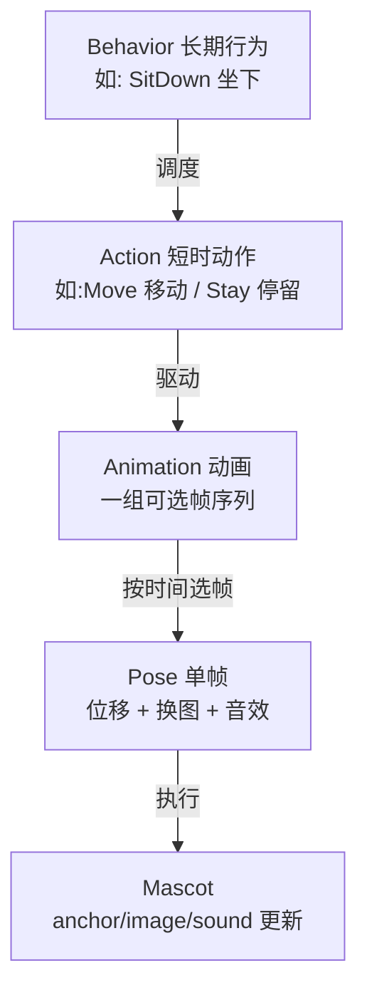
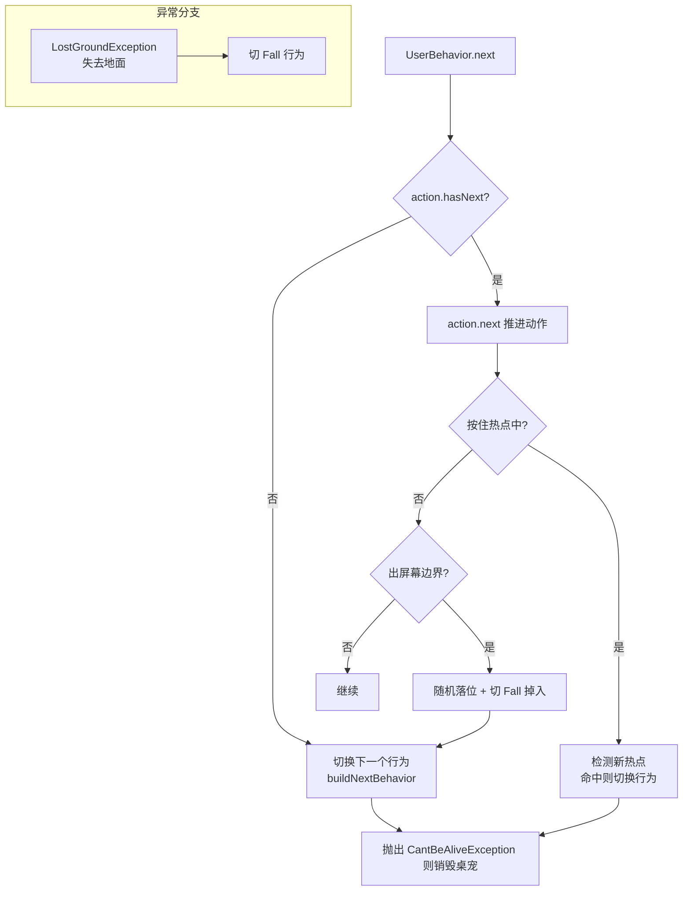
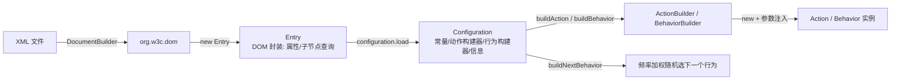

# 03 · 行为状态机与配置系统

> 本文是整个项目**最核心**的部分：桌宠为什么"会动、会走、会爬墙、会卖萌"。
> 涉及包：`behavior/`、`action/`、`animation/`、`config/`、`script/`、`hotspot/`。
> 设计哲学：**一切行为规则用 XML 描述，Java 只提供"积木"（动作原语）**。

---

## 1. 四层模型总览



| 层 | 接口/类 | 生命周期 | 职责 |
|---|---|---|---|
| Behavior | `Behavior` 接口 / `UserBehavior` | 长期（多个动作） | 选择下一个 Action；响应鼠标按下/释放；越界处理 |
| Action | `Action` 接口 / `ActionBase` 及子类 | 短时（几十~几百 tick） | 每 tick 更新桌宠状态；结束后返回 hasNext=false |
| Animation | `Animation` | 一个动作内的多个候选动画 | 带条件（condition），按当前时间选 Pose |
| Pose | `Pose` | 单帧 | 位移 `(dx,dy)`、设置图像、播放音效、持续 `duration` tick |

---

## 2. 各层接口详解

### 2.1 Behavior（`behavior/Behavior.java`）

```java
public interface Behavior {
    void init(Mascot mascot) throws CantBeAliveException;
    void next() throws CantBeAliveException;
    void mousePressed(MouseEvent e) throws CantBeAliveException;
    void mouseReleased(MouseEvent e) throws CantBeAliveException;
}
```

- `init`：绑定桌宠、初始化内部 Action；若 Action 立即结束则直接切换到下一个行为；
- `next`：每 tick 由 `Mascot.tick()` 调用；
- `mousePressed/Released`：鼠标交互（拖拽/热点）。

**唯一实现 `UserBehavior`**：通过 `Configuration` 构建，内部持有一个 `Action` 与 `Configuration` 引用。

### 2.2 Action（`action/Action.java`）

```java
public interface Action {
    void init(Mascot mascot) throws VariableException;
    boolean hasNext() throws VariableException;
    void next() throws LostGroundException, VariableException;
}
```

- `init`：绑定桌宠、初始化变量与动画；
- `hasNext`：是否继续（条件满足 && 未超时长）；
- `next`：推进一帧；`LostGroundException` 表示"失去地面"（如脚下的窗被关闭），由行为层捕获并切到 `Fall`。

### 2.3 ActionBase —— 动作模板基类

`action/ActionBase.java` 为所有动作提供公共骨架：

```java
public void next() throws LostGroundException, VariableException {
    initFrame();                       // 刷新变量帧 + 动画帧
    if (!getMascot().getAffordances().isEmpty()) getMascot().getAffordances().clear();
    if (!getAffordance().trim().isEmpty()) getMascot().getAffordances().add(getAffordance());
    refreshHotspots();                 // 从当前有效动画加载热点
    tick();                            // ← 子类实现具体行为
}
```

通用参数（从 XML 读取，支持表达式）：
- `Duration`：动作最大时长（默认 `Integer.MAX_VALUE`）
- `Condition`：生效条件（默认 true）
- `Draggable`：是否可被拖拽（默认 true）
- `Affordance`：交互标签
- `Name`：动作名

### 2.4 Animation（`animation/Animation.java`）

```java
public class Animation {
    private final Variable condition;  // 动画生效条件
    private final Pose[] poses;        // 帧序列
    private final Hotspot[] hotspots;  // 该动画期间生效的热点
    private final boolean turn;        // 是否随朝向翻转

    public Pose getPoseAt(int time) {  // time 对总时长取模后定位帧
        time %= getDuration();
        for (final Pose pose : getPoses()) {
            time -= pose.getDuration();
            if (time < 0) return pose;
        }
        return null;
    }
}
```

要点：动画**循环播放**（`time %= duration`）；条件不满足的动画会被 `isEffective` 过滤。

### 2.5 Pose（`animation/Pose.java`）

```java
public class Pose {
    private final String image;       // 左向图名（可空）
    private final String rightImage;  // 右向图名（可空，双图角色用）
    private final int dx, dy;         // 本帧位移（右向时 dx 取反）
    private final int duration;       // 持续 tick 数
    private final String sound;       // 音效名

    public void next(final Mascot mascot) {
        mascot.setAnchor(new Point(mascot.getAnchor().x + (mascot.isLookRight() ? -getDx() : getDx()),
                                   mascot.getAnchor().y + getDy()));
        mascot.setImage(ImagePairs.getImage(getImageName(), mascot.isLookRight()));
        mascot.setSound(getSoundName());
    }
}
```

---

## 3. UserBehavior 的执行流程（关键）

`behavior/UserBehavior.java` 是默认行为实现，`next()` 每 tick 执行：



### 3.1 鼠标按下（mousePressed）

1. 优先检查**热点**（hotspot）：命中且行为已启用 → 切换到热点对应行为；
2. 否则若当前动作 `Draggable=false` → 不拖拽；
3. 否则切换到 **Dragged** 行为（拖拽跟随鼠标）。

### 3.2 鼠标释放（mouseReleased）

- 若正在拖拽 → `dragging=false` → 切换到 **Thrown** 行为（抛出，带惯性）。

### 3.3 越界处理

若桌宠完全滑出屏幕（`screen` 区域），则按 `Multiscreen` 设置随机落位到屏幕顶部上方（`top - 256`），再切换 `Fall` 掉回来。

---

## 4. 配置系统（config/）

### 4.1 解析链路



### 4.2 Entry —— XML 节点的轻量封装

`config/Entry.java`：

```java
public String getName();                              // 标签名
public Map<String, String> getAttributes();           // 全部属性（LinkedHashMap 保序）
public String getAttribute(String name);              // 单属性
public List<Entry> selectChildren(String tagName);    // 按标签名选子节点（缓存）
public List<Entry> getChildren();                     // 全部元素子节点
```

注意：`selectChildren` 有缓存（`Map<String, List<Entry>> selected`），同一 tag 只遍历一次。

### 4.3 Configuration —— 配置容器

`config/Configuration.java` 核心字段：

```java
private final Map<String, String> constants;        // <Constant Name=... Value=.../>
private final Map<String, ActionBuilder> actionBuilders;    // <Action Name=.../>
private final Map<String, BehaviorBuilder> behaviorBuilders;
private final Map<String, String> information;      // <Information> 内容
private ResourceBundle schema;                       // 标签名映射（en-US/ja-JP）
```

#### schema 机制（重要）

`Configuration.load()` 先探测 XML 是否含日文标签（`動作リスト`/`行動リスト`），据此加载 `schema_en-US.properties` 或 `schema_ja-JP.properties`。**XML 标签名不是硬编码的**，全部经 `schema.getString("ActionList")` 等间接引用 —— 这是为了兼容日文/英文两套 XML 生态。

### 4.4 行为构建与频率加权随机

`buildNextBehavior(previousName, mascot)` 是"桌宠下一步干嘛"的决策器：

```java
for (BehaviorBuilder b : behaviorBuilders.values()) {
    if (b.isEffective(context) && isBehaviorEnabled(b, mascot)) {
        candidates.add(b);
        totalFrequency += b.getFrequency();
    }
}
// 若上一个行为指定了 NextBehavior，则在其候选集中追加
double random = Math.random() * totalFrequency;
for (BehaviorBuilder b : candidates) {
    random -= b.getFrequency();
    if (random < 0) return b.buildBehavior();
}
```

- **Condition 过滤**：`isEffective` 用当前变量上下文求值行为条件；
- **Frequency 加权**：频率即权重，越大越容易被选中（这就是"坐 100、躺 1"的来源）；
- 若候选为空 → 随机落位并返回 `Fall` 兜底。

### 4.5 behaviors.xml 结构示例（conf/behaviors.xml）

```xml
<BehaviorList>
    <!-- 必选基础行为 -->
    <Behavior Name="Fall" Frequency="0" Hidden="true" />
    <Behavior Name="Dragged" Frequency="0" Hidden="true" />
    <Behavior Name="Thrown" Frequency="0" Hidden="true" />

    <!-- 条件分组：在 Floor 上时可选的子行为 -->
    <Condition Condition="#{mascot.environment.floor.isOn(mascot.anchor) ||
                             mascot.environment.activeIE.topBorder.isOn(mascot.anchor)}">
        <Behavior Name="StandUp" Frequency="200" Hidden="true" />
        <Behavior Name="SitDown" Frequency="200">
            <NextBehavior Add="true">
                <BehaviorReference Name="SitWhileDanglingLegs" Frequency="100" />
                <BehaviorReference Name="LieDown" Frequency="100" />
            </NextBehavior>
        </Behavior>
        <Behavior Name="SplitIntoTwo" Frequency="50" Condition="#{mascot.totalCount &lt; 50}" />
    </Condition>
</BehaviorList>
```

属性语义：
| 属性 | 含义 |
|---|---|
| `Name` | 行为名（`Schema` 中 Fall/Dragged/Thrown 被硬编码引用，必须存在） |
| `Frequency` | 被随机选中的权重（0 = 不作为普通候选，仅可被引用） |
| `Hidden` | 不出现在右键菜单 |
| `Condition` | 生效条件表达式 |
| `NextBehavior Add="true/false"` | 本行为结束后，是"追加"还是"仅用"这些后续候选 |
| `BehaviorReference` | 指向其他行为的引用 + 权重 |

### 4.6 actions.xml 结构示例（conf/actions.xml）

```xml
<ActionList>
    <!-- 嵌入式动作：直接用 Java 类 -->
    <Action Name="Look" Type="Embedded" Class="com.group_finity.mascot.action.Look" />

    <!-- 组合动作 -->
    <Action Name="Walk" Type="Move" BorderType="Floor">
        <Animation>
            <Pose Image="/Stand.png" ImageAnchor="64,128" Velocity="-2,0" Duration="6" />
            <Pose Image="/WalkLeft.png" ImageAnchor="64,128" Velocity="-2,0" Duration="6" />
            ...
        </Animation>
    </Action>

    <!-- 带条件动画：光标在屏上半部时抬头看 -->
    <Action Name="SitAndLookAtMouse" Type="Stay" BorderType="Floor">
        <Animation Condition="#{mascot.environment.cursor.y &lt; mascot.environment.screen.height/2}">
            <Pose Image="/SitLookUp.png" ImageAnchor="64,128" Velocity="0,0" Duration="250" />
        </Animation>
        <Animation>
            <Pose Image="/Sit.png" ImageAnchor="64,128" Velocity="0,0" Duration="250" />
        </Animation>
    </Action>
</ActionList>
```

`Type` → Java 实现映射（由 `ActionBuilder` 处理）：
- `Embedded`：`Class` 属性直接指定 Java 类（Look/Offset 等无参原语）；
- `Stay` / `Move` / `Animate` / `Jump` / `Breed` / `ThrowIE` / `Interact` / `Sequence` / `Select` / `Broadcast` / `Regist` / `Dragged` 等：内置组合动作类型。

`Pose` 属性：
| 属性 | 含义 |
|---|---|
| `Image` / `ImageRight` | 左/右向图（`ImageAnchor` 为图中"脚"的锚点） |
| `Velocity` | 每帧位移 `(dx,dy)` |
| `Duration` | 本帧持续 tick 数 |
| `Sound` | 音效 |
| `BornMascot` / `TransformMascot`（Action 级） | 出生子桌宠 / 变身目标图像集 |

---

## 5. 变量系统（script/）

动作/行为/动画/帧中的条件、参数都支持表达式，核心是 `script/` 包：

### 5.1 三种变量形式（Variable.parse）

```java
if (source.startsWith("${") && source.endsWith("}")) result = new Script(inner, false); // 每帧求值
else if (source.startsWith("#{") && source.endsWith("}")) result = new Script(inner, true);  // 每行为求值
else result = new Constant(parseConstant(source));  // 字面量：null/true/false/数字/字符串
```

| 形式 | 含义 | 求值时机 |
|---|---|---|
| `${expr}` | 每帧（frame）求值 | `initFrame()` |
| `#{expr}` | 每次行为（behavior）求值 | `init()`（行为开始时） |
| 字面量 | `null`/`true`/`false`/数字/字符串 | 恒定 |

> 区别的意义：`#{}` 适合"行为开始时决定一次"的条件（如随机选站姿）；`${}` 适合"每帧都要感知"的条件（如光标位置、是否贴地）。

### 5.2 可用上下文（VariableMap）

- `mascot`：当前桌宠（`anchor`、`imageSet`、`lookRight`、`count`、`totalCount`、`getBounds()` 等）；
- `mascot.environment`：`screen`/`workArea`/`activeIE`/`cursor`/`floor`/`ceiling`/`leftWall`/`rightWall`/`isScreenTopBottom()` 等；
- `action`：当前动作（在 ActionBase.init 注入）；
- 常量：`<Constant Name=... Value=.../>` 中定义，注入上下文且优先级低于 mascot。

示例表达式（摘自 behaviors.xml）：
```js
#{mascot.environment.floor.isOn(mascot.anchor) || mascot.environment.activeIE.topBorder.isOn(mascot.anchor)}
#{ mascot.lookRight ? (mascot.environment.workArea.rightBorder.isOn(mascot.anchor) || ...) : (...) }
#{mascot.totalCount < 50}
```

---

## 6. Hotspot —— 热点交互

`hotspot/Hotspot.java`：桌宠身上一个可点击区域（矩形 + 关联行为名）。

- 在 `Animation` 中声明，随动画生效（`ActionBase.refreshHotspots` 每帧刷新 `mascot.getHotspots()`）；
- 鼠标悬停显示手型光标（`Mascot.refreshCursor`）；
- 点击命中 → 切换到热点指定行为（`UserBehavior.mousePressed`）；
- 按住不放时，行为可在新出现的热点间切换（`UserBehavior.next` 中的 `HotspotResult` 逻辑）。

---

## 7. 完整运行示例：桌宠"坐下"

1. `Fall` 掉到地面（动作 `Move` + `BorderType="Floor"`，`Wall/FloorCeiling` 检测贴地）；
2. 贴地后 `UserBehavior.next()` 发现 `action.hasNext()==false`；
3. 调用 `configuration.buildNextBehavior("Fall", mascot)`：按 `<Condition>`（floor 命中）+ `Frequency` 加权随机；
4. 选中 `SitDown` 行为 → `BehaviorBuilder.buildBehavior()` 构造 `UserBehavior`（内含 `Stay` 动作 + `Sit` 动画）；
5. `UserBehavior.init` → `Action.init` → 动画条件求值、帧播放；
6. 每 tick：`Mascot.tick` → `behavior.next` → `action.next` → `Pose.next`（移动锚点/换图/发音效）；
7. 期间鼠标按下 → 切 `Dragged`；松手 → 切 `Thrown`；被窗沿挡住 → `LostGroundException` → 切 `Fall`。

---

## 8. 学习要点

1. **XML 是"剧本"，Java 是"演员"**：新增外观/行为通常只需改 `img/<set>/conf/` 下的 XML，不改 Java；
2. `Frequency` 加权随机 + `Condition` 过滤 = 简单而强大的 AI 决策；
3. `#{}` 与 `${}` 的求值时机区分，是理解动画/条件是否"每帧更新"的关键；
4. `Fall`/`Dragged`/`Thrown` 三个行为名被代码硬编码引用（`UserBehavior.BEHAVIOURNAME_*`），**任何图像集都必须在 behaviors.xml 中声明它们**；
5. `Schema` 资源包让项目兼容日文/英文两套 XML 方言，是历史兼容性设计。
