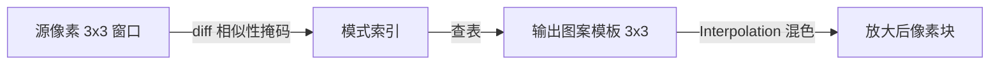

# 04 · 渲染与图像系统

> 涉及包：`image/`、`hqx/`。
> 从"一张 PNG 帧"到"屏幕上透明浮动的小人"，中间经过：加载 → 预乘透明 → 缩放 → 翻转 → 平台原生图像 → 透明窗口绘制。

---

## 1. 图像系统总体管线

```mermaid
flowchart LR
    A[PNG 帧<br/>Pose.Image] --> B[ImagePairLoader.load]
    B --> C[loadImage<br/>外部文件优先 / classpath 兜底]
    C --> D[premultiply<br/>预乘 alpha + 透明度]
    D --> E[scale<br/>滤镜缩放 nearest/hqx/bicubic]
    E --> F[flip<br/>左图水平翻转生成右图]
    F --> G[ImagePair<br/>left + right + center]
    G --> H[ImagePairs 全局缓存<br/>ConcurrentHashMap]
    H --> I[MascotImage -> NativeImage<br/>平台原生位图]
    I --> J[TranslucentWindow<br/>平台分层窗口]
```



---

## 2. 类职责

| 类 | 职责 |
|---|---|
| `ImagePairLoader` | 静态工具：加载、预乘、缩放、翻转 |
| `ImagePair` | 一"对"图像（左向图 + 右向图 + 中心锚点），按朝向取图 |
| `ImagePairs` | 全局缓存（`ConcurrentHashMap<String, ImagePair>`） |
| `MascotImage` | `BufferedImage` + `center` 中心点的记录 |
| `NativeImage` | 平台原生图像接口（Windows 下是 HBITMAP 句柄） |
| `TranslucentWindow` | 平台透明窗口接口 |

### 2.1 ImagePairs 缓存

```java
public class ImagePairs {
    private static final ConcurrentHashMap<String, ImagePair> imagepairs = new ConcurrentHashMap<>();
    public static void load(String filename, ImagePair imagepair);  // 已存在则跳过
    public static ImagePair getImagePair(String filename);
    public static MascotImage getImage(String filename, boolean isLookRight);
    public static void removeAll(String searchTerm);   // 按图像集名清缓存（换图集用）
}
```

**key = Pose 的 `Image + ImageRight` 拼接**，因此同一帧在不同行为间共享缓存，避免重复加载。

---

## 3. ImagePairLoader 详解

源码：`src/main/java/com/group_finity/mascot/image/ImagePairLoader.java`

### 3.1 load() 入口

```java
public static void load(String name, String rightName, Point center,
                        double scaling, Filter filter, double opacity) throws IOException {
    if (ImagePairs.contains(name + (rightName == null ? "" : rightName))) return;  // 已缓存

    final BufferedImage leftImage  = scale(premultiply(loadImage(name), opacity), scaling, filter);
    final BufferedImage rightImage;
    if (rightName == null) {
        rightImage = flip(leftImage);                    // 单图 → 水平翻转得到右向图
    } else {
        rightImage = scale(premultiply(loadImage(rightName), opacity), scaling, filter);
    }

    ImagePair ip = new ImagePair(
        new MascotImage(leftImage,  new Point(round(center.x * scaling), round(center.y * scaling))),
        new MascotImage(rightImage, new Point(rightImage.getWidth() - round(center.x * scaling),
                                              round(center.y * scaling))));
    ImagePairs.load(name + (rightName == null ? "" : rightName), ip);
}
```

### 3.2 loadImage —— 双路径查找

```java
private static BufferedImage loadImage(final String imagePath) throws IOException {
    // 1. 外部文件：./img/<path>（MSI 便携版场景）
    File externalFile = new File("./img/" + normalizedPath);
    if (externalFile.exists()) return ImageIO.read(externalFile);
    // 2. classpath 资源（JAR 内嵌）
    InputStream resourceStream = ImagePairLoader.class.getResourceAsStream(imagePath);
    if (resourceStream != null) return ImageIO.read(resourceStream);
    throw new IOException("Cannot find image: " + imagePath);
}
```

### 3.3 premultiply —— 预乘 alpha

将像素从"直通 alpha"转为"**预乘 alpha**"（RGB 各通道预先乘以 alpha），并施加整体 `opacity` 透明度：

```java
components[3] *= opacity;                 // 整体透明度
components[0] = components[3] * components[0];  // RGB × alpha
...
```

> 预乘的意义：后续任何缩放/绘制（特别是 `TYPE_INT_ARGB_PRE`）不会产生"黑边/亮边"伪影，是像素级缩放（HQX）正确性的前提。

### 3.4 scale —— 三级滤镜

```java
public enum Filter { NEAREST_NEIGHBOUR, HQX, BICUBIC }
```

处理顺序（注意当前源码 125-134 行的 LicenseManager 残余会拦截 HQX，详见文档 06）：

1. **HQX 分支**（`filter==HQX && scaling>1`）：
   - `scaling==4|8` → `Hqx_4x.hq4x_32_rb()` 先 4 倍，再用 `effectiveScaling` 补齐（8 倍时再 2 倍）；
   - `scaling==3|6` → `Hqx_3x.hq3x_32_rb()`；
   - `scaling==2` → `Hqx_2x.hq2x_32_rb()`；
   - 其余 → 退回 nearest；
2. **Graphics2D 绘制**：
   - `BICUBIC` → `RenderingHints.VALUE_INTERPOLATION_BICUBIC`；
   - 否则 `NEAREST_NEIGHBOR`；
   - 若 HQX 已生成 `workingImage`，则按 `effectiveScaling` 拉伸到目标尺寸。

```java
Object renderHint = filter == Filter.BICUBIC
        ? RenderingHints.VALUE_INTERPOLATION_BICUBIC
        : RenderingHints.VALUE_INTERPOLATION_NEAREST_NEIGHBOR;
```

### 3.5 flip —— 水平翻转

```java
for (y...) for (x...)
    copy.setRGB(copy.getWidth() - x - 1, y, src.getRGB(x, y));
```

逐像素水平镜像。单图角色因此天然获得"右向"帧；双图角色（`ImageRight`）则直接加载。

---

## 4. HQX 像素放大算法（hqx/ 包）

> 经典 hq3x/hq4x 像素艺术放大算法，用于低分辨率像素小人无损放大（边缘平滑不模糊）。

| 类 | 说明 |
|---|---|
| `Hqx` | 基类：`diff()` 颜色差异判断（RGB→YUV 阈值） |
| `Hqx_2x` | hq2x 2 倍放大 |
| `Hqx_3x` | hq3x 3 倍放大 |
| `Hqx_4x` | hq4x 4 倍放大 |
| `Interpolation` | 颜色插值（`Mix3To1`/`Mix2To1To1` 等，边缘过渡平滑） |
| `RgbYuv` | RGB↔YUV 查找表（`hqxInit()` 构建 `0x1000000` 大小表） |

### 原理（以 hq3x 为例）

1. 对每个源像素，考察其 **8 邻域**（3×3 窗口）；
2. 用 `diff()` 判断邻域像素与中心像素的"相似性"（YUV 空间阈值比较）；
3. 依据 8 邻域的相似/不相似模式（数百种组合），查表选择对应的 3×3 输出图案；
4. 输出图案中的过渡像素用 `Interpolation` 做颜色混合，得到平滑边缘。



> 工程上以"**查表 + 位运算**"实现（`Hqx_3x.java` 约 115KB 的 `hq3x_32_rb` 方法即查表代码），性能足够实时。

---

## 5. 透明窗口与绘制

### 5.1 接口

```java
public interface TranslucentWindow {
    Component asComponent();      // AWT 组件（JWindow 等）
    void setImage(NativeImage image);
    void updateImage();           // 触发重绘
    void dispose();
    void setAlwaysOnTop(boolean onTop);
}
```

### 5.2 Windows 实现（WindowsTranslucentWindow）

继承 `JWindow`，在 `paint()` 中用 **Win32 分层窗口 API** 直接绘制位图：

```java
private void paint(final Pointer imageHandle, final int alpha) {
    final Pointer hWnd = Native.getComponentPointer(this);
    if (User32.INSTANCE.IsWindow(hWnd) != 0) {
        // ① 确保 WS_EX_LAYERED 扩展样式
        final int exStyle = User32.INSTANCE.GetWindowLongW(hWnd, User32.GWL_EXSTYLE);
        if ((exStyle & User32.WS_EX_LAYERED) == 0)
            User32.INSTANCE.SetWindowLongW(hWnd, User32.GWL_EXSTYLE, exStyle | User32.WS_EX_LAYERED);
        // ② 创建内存 DC，选入 HBITMAP
        final Pointer clientDC = User32.INSTANCE.GetDC(hWnd);
        final Pointer memDC = Gdi32.INSTANCE.CreateCompatibleDC(clientDC);
        final Pointer oldBmp = Gdi32.INSTANCE.SelectObject(memDC, imageHandle);
        // ③ UpdateLayeredWindow 合成（源 alpha 混合 + 全局 alpha）
        final BLENDFUNCTION bf = new BLENDFUNCTION();
        bf.BlendOp = BLENDFUNCTION.AC_SRC_OVER;
        bf.SourceConstantAlpha = (byte) alpha;   // 全局透明度
        bf.AlphaFormat = BLENDFUNCTION.AC_SRC_ALPHA;
        User32.INSTANCE.UpdateLayeredWindow(hWnd, Pointer.NULL, lt, size, memDC, zero, 0, bf, User32.ULW_ALPHA);
        // ④ 清理
        Gdi32.INSTANCE.SelectObject(memDC, oldBmp);
        Gdi32.INSTANCE.DeleteDC(memDC);
    }
}
```

流程：`Mascot.apply()` → `window.setBounds` + `window.setImage` + `window.updateImage()`（= `repaint()`）→ 平台 `paint()` 调用原生 API 合成。

### 5.3 其他平台

| 平台 | 实现方式 |
|---|---|
| Windows | `WS_EX_LAYERED` + `UpdateLayeredWindow`（如上） |
| X11 | shape 扩展 + alpha（`X11TranslucentWindow`） |
| macOS | `MacTranslucentWindow`（NSWindow 半透明） |
| Wayland | `WaylandTranslucentWindow` |
| Generic / Virtual | 基于 JNA `WindowUtils.setWindowTransparent` 或 JPanel 内嵌绘制 |

---

## 6. 渲染性能要点

- **缓存**：`ImagePairs` 全局缓存避免每帧重复加载/缩放；
- **预乘**：`ARGB_PRE` 让 Graphics2D 缩放与窗口合成都无边缘伪影；
- **D3D/Metal/Marlin**：`Main` 中按平台开启硬件加速与 Marlin 光栅化器（见文档 01）；
- **双缓冲**：`sun.awt.noerasebackground=true` 等属性减少闪烁；
- **HQX 只对大整数倍缩放有意义**（2/3/4/6/8），且仅当用户选择 hqx 滤镜时启用。

---

## 7. 学习要点

1. 图像管线是"**纯 AWT 处理 + 平台原生输出**"分离的：上层只操作 `BufferedImage`，平台层负责显示；
2. 预乘 alpha 是像素类算法正确性的前提，理解 `premultiply` 很重要；
3. `ImagePair` 的左右图机制让"朝向"完全透明：动作逻辑只关心 `lookRight` 布尔值；
4. HQX 是"查表式"像素放大，若想扩展新倍率/新滤镜，`scale()` 是最自然的切入点（注意先处理文档 06 中的 license 残余）。
