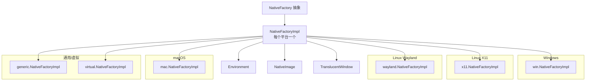

# 05 · 平台抽象与原生实现

> 涉及包：`generic/`、`win/`（含 `win/jna/`）、`x11/`、`mac/`、`wayland/`、`virtual/`。
> 核心目标：**让上层代码（Main/Manager/Mascot/动作）与操作系统彻底解耦**——同一套逻辑在 Windows / Linux(X11/Wayland) / macOS 上运行。

---

## 1. 抽象层接口

所有平台实现都围绕 `NativeFactory` 的三个抽象方法展开（`NativeFactory.java`）：

```java
public abstract class NativeFactory {
    public abstract Environment getEnvironment();           // 屏幕/活动窗口/光标
    public abstract NativeImage newNativeImage(BufferedImage src);   // AWT → 原生位图
    public abstract TranslucentWindow newTransparentWindow();       // 原生透明窗口
}
```

对应的三个"可插拔产品"：

| 抽象接口 | 职责 | 平台具体类（示例） |
|---|---|---|
| `Environment` | 环境感知（屏幕/窗口/光标/工作区） | `WindowsEnvironment` / `X11Environment` / `MacEnvironment` / `WaylandEnvironment` / `VirtualEnvironment` / `GenericEnvironment` |
| `NativeImage` | 原生图像（位图句柄） | `WindowsNativeImage`（HBITMAP）等 |
| `TranslucentWindow` | 原生透明窗口 | `WindowsTranslucentWindow`（JWindow + Layered）等 |



---

## 2. 平台选择（NativeFactory.resetInstance）

```java
String environment = Main.getInstance().getProperties().getProperty("Environment", "generic");
if (environment.equals("generic")) {
    if (Platform.isWindows())      instance = new win.NativeFactoryImpl();
    else if (Platform.isMac())     instance = new mac.NativeFactoryImpl();
    else if (Platform.isX11()) {
        instance = isWayland() ? new wayland.NativeFactoryImpl()
                               : new x11.NativeFactoryImpl();
    }
    else instance = new generic.NativeFactoryImpl();
} else if (environment.equals("virtual"))   instance = new virtual.NativeFactoryImpl();
else if (environment.equals("wayland"))     instance = new wayland.NativeFactoryImpl();
else instance = new generic.NativeFactoryImpl();
```

Wayland 探测：环境变量 `WAYLAND_DISPLAY` 非空 或 `XDG_SESSION_TYPE=wayland`。

> `Environment` 配置项可强制指定运行环境，是虚拟桌面模式（`virtual`）和 Wayland 强制模式的开关。

---

## 3. Windows 实现（win/）

| 类 | 说明 |
|---|---|
| `NativeFactoryImpl` | 工厂实现 |
| `WindowsEnvironment` | 屏幕/活动窗口（通过 Win32 枚举窗口获取标题、RECT） |
| `WindowsNativeImage` | 由 `BufferedImage` 创建 HBITMAP（`getHandle()`） |
| `WindowsTranslucentWindow` | `JWindow` + `WS_EX_LAYERED` + `UpdateLayeredWindow`（见文档 04） |
| `AutoStartManager` | 注册表实现开机自启 |
| `win/jna/` | JNA 绑定：`User32`、`Gdi32`、`Dwmapi`、`RECT`、`POINT`、`SIZE`、`BITMAP`、`MONITORINFO`、`BLENDFUNCTION`、`BITMAPINFOHEADER` |

### WindowsEnvironment 关键能力

- `getActiveIE()`：返回当前前台窗口的 `Area`（桌宠可站在"窗口顶/边"上）；
- `getActiveIETitle()`：前台窗口标题；
- `moveActiveIE(Point)`：移动窗口（桌宠可以"拖走"窗口）；
- `restoreIE()`：把所有被缩到最小的窗口恢复；
- `refreshCache()`：刷新窗口列表缓存。

---

## 4. Linux X11 实现（x11/）

| 类 | 说明 |
|---|---|
| `NativeFactoryImpl` | 工厂实现 |
| `X11Environment` | 通过 X11 查询屏幕/窗口 |
| `X11NativeImage` | X11 Pixmap |
| `X11TranslucentWindow` | X11 半透明窗口（Shape + alpha） |
| `X11Window` | X11 窗口封装 |
| `X` | **JNA 对 X11/Xlib 的面向对象封装**（约 2500 行）：`Display`、`Window`、`GC`、事件循环等 |

> `X.java` 头部注释：部分代码基于 wmctrl（GPLv2），由 Stefan Endrullis 编写，随 JNA 双许可（LGPL/Apache）发布。

### X11 透明窗口原理

X11 本身不支持分层 alpha 窗口，实现透明需要组合：
- **Shape 扩展**：`XShapeCombineMask` 用掩码裁出非透明区域；
- 或者 **Composite/ARGB Visual**（现代合成器下）直接提供 32 位视觉。

---

## 5. macOS 实现（mac/）

| 类 | 说明 |
|---|---|
| `NativeFactoryImpl` | 工厂实现 |
| `MacEnvironment` | 屏幕/窗口（CGWindowList 等） |
| `MacTranslucentWindow` | NSWindow 半透明窗口 |
| `AutoStartManager` | LaunchAgent plist 实现开机自启 |

> `Main.configureHighDPIGlobally()` 中为 macOS 开启 Metal 渲染（`sun.java2d.metal=true`）与 Retina 支持，配合本包工作。

---

## 6. Wayland 实现（wayland/）

Wayland 协议与 X11 完全不同（无全局坐标、客户端自绘合成），实现较受限：

| 类 | 说明 |
|---|---|
| `NativeFactoryImpl` | 工厂实现 |
| `WaylandEnvironment` | 环境感知 |
| `WaylandNativeImage` | 原生图像 |
| `WaylandTranslucentWindow` | 透明窗口 |

**已知限制**（代码中体现）：
- 系统托盘不可用（`Main.createTrayIcon` 捕获 `UnsupportedOperationException` 并降级为右键菜单）；
- 窗口置顶/定位能力依赖 Wayland 合成器支持。

---

## 7. Generic（通用 fallback）实现（generic/）

基于 **JNA `com.sun.jna.platform.WindowUtils`**：

| 类 | 说明 |
|---|---|
| `NativeFactoryImpl` | 工厂实现 |
| `GenericEnvironment` | 用 JDK AWT 默认屏幕（`GraphicsEnvironment`） |
| `GenericNativeImage` | 直接持有 `BufferedImage` |
| `GenericTranslucentWindow` | `WindowUtils.setWindowTransparent(...)` 实现真透明 |

> 作用：无法识别平台（或非主流 OS）时兜底，保证程序不崩溃。

---

## 8. Virtual（虚拟桌面）实现（virtual/）

| 类 | 说明 |
|---|---|
| `NativeFactoryImpl` | 工厂实现 |
| `VirtualEnvironment` | 虚拟环境（自定义尺寸） |
| `VirtualContentPanel` | 承载桌宠的 JPanel |
| `VirtualNativeImage` | 原生图像（直接 BufferedImage） |
| `VirtualTranslucentPanel` | 透明面板 |

> 用途：**无原生窗口环境下的开发/测试/演示**。把 `Environment=virtual` 写入 settings 即启用，桌宠显示在普通 JFrame 内。

---

## 9. JNA 机制速览

项目没有写任何 JNI/native 代码，全靠 **JNA（Java Native Access）**：

```java
// 例：User32.java（win/jna/）
public interface User32 extends Library {
    User32 INSTANCE = Native.load("user32", User32.class);  // 加载 user32.dll
    int GWL_EXSTYLE = -20;
    int WS_EX_LAYERED = 0x00080000;
    int IsWindow(Pointer hWnd);
    int GetWindowLongW(Pointer hWnd, int nIndex);
    int SetWindowLongW(Pointer hWnd, int nIndex, int dwNewLong);
    Pointer GetDC(Pointer hWnd);
    boolean UpdateLayeredWindow(Pointer hWnd, Pointer hdcDst, POINT pptDst, SIZE psize, ...);
    // ...
}
```

- `Native.load("user32", User32.class)` 自动加载系统 DLL 并做类型映射；
- 结构体（`RECT`/`POINT`/`SIZE`/`BLENDFUNCTION`）继承 `Structure`，字段映射 C 结构体；
- `Native.getComponentPointer(this)` 获取 AWT 组件的 HWND（JNA 扩展能力）。

---

## 10. 平台扩展指南（新增平台）

若想支持新平台（如 Android/FreeBSD），需要：

1. 新建包 `com.group_finity.mascot.<platform>/`；
2. 实现 `NativeFactoryImpl`（继承 `NativeFactory`）、`Environment`、`NativeImage`、`TranslucentWindow`；
3. 在 `NativeFactory.resetInstance()` 中添加选择分支；
4. 补充 `AutoStartManager`（如平台支持）。

```java
public class MyPlatformFactoryImpl extends NativeFactory {
    public Environment getEnvironment()          { return new MyEnvironment(); }
    public NativeImage newNativeImage(BufferedImage src) { return new MyNativeImage(src); }
    public TranslucentWindow newTransparentWindow()     { return new MyTranslucentWindow(); }
}
```

---

## 11. 学习要点

1. **抽象工厂模式**：`NativeFactory` 是稳定抽象，各平台 `NativeFactoryImpl` 是具体工厂，上层只依赖接口；
2. 三种产品（环境/图像/窗口）对应三个正交维度，新增平台 = 实现 1 工厂 + 3 产品；
3. JNA 让项目零 JNI 即可调用 Win32/X11，`win/jna/` 是学习 JNA 绑定（Library + Structure）的好范例；
4. Wayland 与传统窗口管理模型冲突，是当前实现限制最多的平台，也是未来优化重点方向之一。
